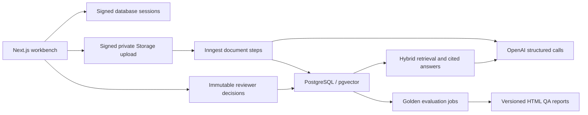

# EvidenceOps

## What It Is

A document intelligence and RAG quality workbench built with Next.js 16, React, TypeScript, PostgreSQL/pgvector and Drizzle. Neon stores production data and password hashes; signed sessions provide authentication and Vercel Blob provides private storage; Inngest runs durable document and evaluation jobs; OpenAI provides structured extraction, independent verification, answers and judging.

**Status:** the synthetic demo is live at https://evidenceops.vercel.app with Neon, private Blob storage, verified sign-in and verified Inngest background processing. An OpenAI key is still required to replace the explicitly labeled mock provider and measure live-model quality. See [deployment status](docs/deployment.md) and the [implementation audit](docs/audit.md).

## The Problem

Extracted values and generated answers need inspectable sources, measurable quality, correction history and recoverable processing. A plausible answer alone is insufficient.

## What This Demo Proves

The synthetic corpus exercises provenance, uncertain values, review decisions, exact duplicates, corrected source editions, cited answers, refusal, regression gates and recovery. The mock provider reads committed fixture truth and golden questions. Its measured scores prove the test workflow and implementation behavior; **they are not independent evidence of live OpenAI model quality**.

## Architecture



Local adapters use PostgreSQL, filesystem storage and signed sessions. Mock mode is explicit and never a fallback for a failed real provider.

## Processing Pipeline

`upload → parse → chunk → extract → deterministic_validate → independent_verify → calculate_confidence → route_review → embed → finalize`

PDF pages and DOCX paragraphs become addressable source blocks. Chunks target 800 tokens with 120-token overlap. Uploads are limited to 10 MB and PDFs to 50 pages. The production browser uploads directly to a scoped private Blob path, avoiding Vercel's function request-size limit. Server actions receive descriptors and validate workspace, user, type and actual byte length.

## Human Review

The queue filters by status, priority, document, field and confidence. A review screen shows the candidate, quote, highlighted context, verifier reason and confidence components. Accept, edit-and-accept and reject create immutable record versions; needs-source stays unresolved. Stale edits are rejected. Reprocessing supersedes old pending review items. The seeded Orchard Valley example records a synthetic reviewer correction from USD 480,000 to USD 512,000.

## Confidence Formula

`0.30 × exact evidence + 0.20 × deterministic validation + 0.25 × verifier support + 0.15 × cross-pass agreement + 0.10 × evidence specificity`

Code computes the score. Values below 0.86 require review; below 0.65 are blocked. Unsupported evidence, missing required provenance and contradictions block auto-approval regardless of the weighted score. Partial support requires review. Specificity preserves the verifier's bounded numeric value.

## Provenance Model

Scalars carry `value`, `source_block_ids`, `evidence_quotes` and `ambiguity`. Each list item has its own provenance. `field_values` and `field_evidence` persist the value, components, verifier results, exact-match offsets and source-block identity. Human locators link directly to highlighted PDF page or DOCX paragraph text. Original files can be downloaded after workspace authorization.

## Document & Record Versioning

A logical document has multiple immutable source editions. Content hashes prevent duplicate editions; corrected sources link to the edition they supersede. Record versions separately preserve initial extraction, reviewer decisions and reprocessing. PostgreSQL uniqueness constraints enforce one current source and one current record. Saved answer evidence remains available through its stored retrieval snapshot.

## RAG

Retrieval combines 75% vector similarity and 25% lexical rank over a normalized candidate pool. Default retrieval excludes superseded sources and incompletely embedded editions. Answers and three draft formats retain citations and retrieval scores. Citation identifiers must resolve to retrieved evidence; a separate verifier checks cited claims. Unsupported answers are replaced with the exact refusal: **Insufficient evidence in the indexed corpus.** `/rag` and `/ask` expose the same workbench. Public visitors can browse saved examples but cannot generate paid output.

## Evaluation

The corpus produces 146 checks: 18 each for extraction, provenance, classification and review routing; 30 retrieval checks; 30 answer checks; 10 refusals; two duplicates; two corrected versions. The 40 golden questions contain 20 single-document, 10 cross-document and 10 unanswerable questions. A separate failure-injection scenario tests resumability. Inngest checkpoints each evaluation case and replays its aggregate contribution without repeating completed calls.

## Regression Gates

Extraction may drop at most 2 percentage points, provenance 1, review recall 5 and retrieval recall 3. Refusal and citation precision must remain at least 95%; semantic score at least 90%; duplicate, version and resumability checks must pass. Success targets are checked separately. Only a passing run can establish a baseline, and only a compatible corpus fingerprint is compared. Provider baselines remain separate. HTML report failure also causes the evaluation CLI to fail.

## Failure Handling

Failures record step, attempt, error and retryability. Retries use 2, 8 and 30 seconds. Exhausted work becomes a dead letter with an admin retry action. Embedding failure retains the extracted record while excluding the edition from retrieval. Corrupt files and scanned PDFs fail explicitly. Dispatch failure marks the run failed instead of leaving it queued.

## Resumability & Idempotency

Database advisory locks serialize duplicate deliveries and uploads. Use a **direct Neon connection**, not a `-pooler` hostname or transaction pooling on port 6543. Parsing and chunking keys are independent of model changes. Extraction and verifier batch checkpoints preserve completed work; embeddings cache by text/model/dimension. A per-run document outcome ledger prevents counter inflation. Record creation checks persisted extraction identity before inserting. Worker configuration drift fails visibly and requires a new processing run.

## Data & Synthetic Corpus

**All demo documents are synthetic and generated in-repository.**

20 files: 16 PDFs and 4 DOCX files, representing 16 logical documents and 18 unique source versions, with two exact duplicates and two corrected editions. The corpus has 57 PDF pages including duplicate files, 700–1200 words per source, and 17 planted uncertainty examples (16 expected review routes). Generation fixes PDF metadata and DOCX ZIP/core timestamps; repeated generation produced identical DOCX hashes.

Sources: `fixtures/source/`; documents and manifest: `fixtures/documents/`; truth: `fixtures/truth/`; golden questions: `fixtures/golden/`. Unsupported and corrupt examples live in `fixtures/documents/extras/`.

## Results

Measured on 2026-09-10, provider **mock**, evaluation `52531eab-d7e2-48ec-8d41-8d62161f9015`. All 11 aggregate targets and all 10 regression rules passed; **141/146 individual cases passed**. Three extraction cases and one provenance case retain planted errors, and one cross-document retrieval case misses one expected document at top five. These failures are reported, not hidden.

| Metric | Measured |
| --- | ---: |
| Scalar extraction accuracy | 96.67% |
| List/object micro-F1 | 97.01% |
| Classification accuracy | 100.00% |
| Provenance validity | 99.68% |
| Review recall | 100.00% |
| Review precision | 100.00% |
| Retrieval Recall@5 | 98.33% |
| Citation precision | 100.00% |
| Evidence-supported answers | 100.00% |
| Refusal accuracy | 100.00% |
| Semantic answer score | 100.00% |

16 logical documents; 18 source versions evaluated; 90 scalar fields; 310 non-null provenance claims, 309 valid. Duplicates 2/2; corrected versions 2/2; no duplicate model records; no below-threshold auto-approvals. Failure/retry, resumability and concurrent delivery tests passed.

Uncached evaluation: $0 actual API spend (no OpenAI calls), 89,350 estimated mock input tokens / 4,436 output tokens, p50 2 ms and p95 34 ms per case. Mock latency and cost do not predict production performance. [Machine-readable results](docs/evaluation-results.json) · [HTML QA report](docs/qa-report.html).

## Screenshots

[Dashboard](docs/screenshots/dashboard.png) · [Documents](docs/screenshots/documents.png) · [Provenance](docs/screenshots/provenance.png) · [Review](docs/screenshots/review.png) · [Cited answer](docs/screenshots/answer.png) · [Evaluations](docs/screenshots/evaluations.png) · [Run activity](docs/screenshots/run.png) · [QA report](docs/screenshots/qa-report.png) · [Mobile](docs/screenshots/mobile-documents.png).

## Running Locally

Use Node 22+, pnpm 10.30 and PostgreSQL with the pgvector extension installed. These commands create development/test databases; the test suite resets only its test database.

```bash
corepack enable
pnpm install --frozen-lockfile
createdb evidenceops
createdb evidenceops_test
cp .env.example .env.local
```

Set `.env.local` to `DATABASE_URL=postgres://localhost:5432/evidenceops`, `TEST_DATABASE_URL=postgres://localhost:5432/evidenceops_test`, `LLM_PROVIDER=mock`, `JOB_DRIVER=inline`, `AUTH_DRIVER=local`, `STORAGE_DRIVER=local`. Choose local demo passwords. Use `PUBLIC_DEMO_MODE=true` / `DEMO_MUTATIONS_ENABLED=false` for public read-only browsing; set demo mutations true for a reviewer session.

```bash
pnpm db:migrate
pnpm fixtures:generate
pnpm seed:demo
pnpm dev
```

`seed:demo` ingests the corpus, records one synthetic review, runs evaluation and writes a QA report. `db:seed` seeds only accounts and cases. On this workstation the completed demo uses the fresh `evidenceops_verified` database; prior databases were preserved. Its production preview runs at `http://localhost:3010` because another application uses port 3000.

## Environment Variables

See [.env.example](.env.example) and [production configuration](docs/deployment.md). Required live settings are `DATABASE_URL`, `AUTH_SECRET`, `BLOB_READ_WRITE_TOKEN`, `OPENAI_API_KEY`, `INNGEST_EVENT_KEY`, and `INNGEST_SIGNING_KEY`. Production drivers are database/blob/inngest. Models default to `gpt-5.6-luna`, embeddings to `text-embedding-3-small` with 768 dimensions. Token pricing is centralized in `src/lib/config.ts`; unknown model prices fail explicitly.

Never commit `.env.local`, `.data/production.env` or service keys. Seed passwords must be unique and at least 16 characters. Database, storage and session-signing credentials must never reach the browser.

## Testing

| Command | Verified result |
| --- | --- |
| `pnpm lint` | Passed, no errors or warnings |
| `pnpm typecheck` | Passed |
| `pnpm test` | 49 passed, 11 files |
| `pnpm test:integration` | 20 passed, 5 files |
| `pnpm test:e2e` | 7 passed, Chromium |
| `pnpm eval --no-ingest --no-cache` | EVAL PASSED; all targets/regression gates; 141/146 cases |
| `pnpm build` | Optimized production build passed |
| `pnpm verify:rls` | Local PostgreSQL policy checks passed |

Additional browser audit: eight desktop routes and seven mobile routes returned 200 with no uncaught page errors or page-wide horizontal overflow; anonymous upload/Ask controls disabled. The integration suite covers concurrent uploads/deliveries, checkpoint replay, viewer/non-member denial, immutable review and failure recovery. Real OpenAI transport behavior is tested with MSW for malformed JSON retry and rate limiting.

## Deployment

Vercel project `evidenceops` is linked to `essashahid/EvidenceOps`; Node 22 and pnpm build/install commands are configured. The demo is live at https://evidenceops.vercel.app. Database, storage, authentication and demo settings are synchronized across production, preview and development. The Production Inngest app is synced with six functions, and a hosted document job completed successfully against Neon. OpenAI activation remains pending.

The private `.data/production.env` file contains generated passwords and the current deployment credentials; the OpenAI key remains empty. `pnpm deploy:production` validates configuration, migrates, seeds and evaluates through production Auth/Storage, synchronizes Vercel variables and deploys. [Detailed runbook](docs/deployment.md).

## Security & Privacy

Server actions enforce workspace membership and role; public access is read-only. Mutations share a database rate counter. Database sessions are signed, secure and HTTP-only; login attempts share a database rate limit. Unknown users are not automatically added to a workspace. The Neon database has no browser-facing data API; server queries enforce workspace access. Optional Supabase deployments additionally use RLS. Storage is private; generated reports escape source content and are served with a restrictive content policy. Raw sources and reports enforce workspace authorization. Use a dedicated database for this application. This is not a formal security/compliance certification.

## Limitations

No OCR; no scanned-document interpretation; no image extraction; no complex table reconstruction; synthetic corpus; no legal/compliance function; no tariff/HTS logic. The deterministic provider uses fixture truth and golden questions, so live-model quality remains unmeasured. Hosted Neon authentication, Blob storage, Vercel pages and Inngest delivery are verified; live OpenAI quality remains unverified until activation. Source PDFs can contain page-split sentences, so extractive mock answers may include fragments. Model verification reduces unsupported answers but cannot guarantee correctness. Full-text quality is tuned for English. Five individual evaluation cases remain unsuccessful despite passing aggregate targets.

## What I Would Add for a Client

Client-specific source samples and acceptance tests, a reviewed retention policy, SSO and explicit invitation flows, usage budgets and provider billing reconciliation, asynchronous draft generation for larger contexts, OCR/table handling when required, and evaluation by independent human reviewers.
